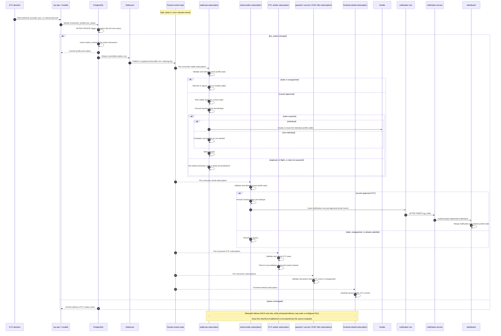

# Holder flows: KYC-pass event

Snapshot: 2026-09-18. This is a source-reading snapshot, not live deployment
evidence. Dedicated repository rows below list the checked branch and revision;
grouped negative-repository rows were searched at their then-current working-
tree branches and revisions. The DEV architecture notes were dated 2026-08-24,
and Terraform describes desired state only.

## What “holder” means here

In this guide, a holder candidate is an `investment_profiles` profile that may
become eligible to invest. `kyc_status=approved` is a profile eligibility
signal. It is not proof that the person or entity owns an investment, shares,
or tokens, and it is not automatic ERC-7943 or on-chain allowlisting.

The shared profile enum includes `individual`, `sdira`, `solo401k`, `trust`,
and `entity`, plus KYC values including `approved`; see
`profiles/consts.go:3-35`. The profile model maps to
`investment_profiles`; see `profiles/models.go:7-64`.

## KYC decision origins

All three origins can change the profile row. The database trigger, rather
than a caller-specific event publisher, decides whether a KYC change event
exists.

- **Plaid webhook:** `kyc-api/internal/app/inter/pubsub.go:80-212` calls the
  provider update. For an individual, it propagates related KYC and, when
  accreditation is already approved, can advance confirmed investments.
- **Provider sync:** `kyc-api/internal/app/inter/internal.go:48-118` loads the
  latest provider result and updates the selected profile. No related-profile
  or investment follow-up call was observed in this app path.
- **Manual decision:** `kyc-api/internal/app/inter/internal.go:134-163`
  delegates to `manual_kyc.go:35-144`. The selected profile and admin history
  are written transactionally; no related-profile or investment follow-up call
  was observed in this app path.

Provider persistence locks and rechecks manual provenance, then calls
`profiles.AppendKYCByID`; see `kyc-api/internal/adapters/db/postgres.go:31-73`.
Manual persistence also uses `AppendKYCByID`, and a complete no-op emits no
state transition; see `kyc-api/internal/adapters/db/manual_kyc.go:84-139`.

The distinction matters: a KYC pass from a webhook may have immediate
related-profile and legal-status side effects, while sync and manual changes
observed here rely on later current-state workflows for any such work.

## Canonical event contract

The canonical profile pass event is `profile.kyc-status.changed.v1`. Its
compact v1 payload has exactly these top-level fields:

```json
{
  "id": "<UUID>",
  "type": "profile.kyc-status.changed.v1",
  "version": 1,
  "source": "postgres-outbox",
  "object": "profile",
  "object_id": "<string>",
  "field": "kyc_status",
  "data": {"kyc_status": "approved"},
  "time": "<timestamp>"
}
```

`id` is a UUID, `object_id` is a string, and `data` contains only the changed
field. The timestamp field is named `time` in the wire contract. The shared
decoder and delivery checks are defined in
`go-common/queue/domainevents/domain_event.go:51-68,266-328`.

An `AFTER UPDATE` trigger on `investment_profiles` monitors `kyc_status` and
`accreditation_status`; see
`migration-service/migrations/08_investment_profiles/08_domain_event_triggers.sql:4-29`.
The outbox function inserts only when the old and new monitored values differ,
and inserts the payload transactionally into `outbox_events`; see
`migration-service/migrations/01_queue/06_domain_outbox_events.sql:95-177`.
Therefore an unchanged KYC write has no KYC status event. The outbox aggregate
and ordering key are `profile:<id>`.

Debezium reads committed outbox rows and publishes the domain-event stream;
the DEV topology notes describe this as pgoutput to `dev-domain-events` in
`ansible-devops/docs/event-architecture.md:55-63,85-92`. The environment topic
form is `<env>-domain-events`. Delivery is at least once: consumers must
expect redelivery and deduplicate by immutable event ID. The transport decoder
validates copied attributes and the ordering key; see
`go-common/queue/domainevents/domain_event.go:307-328`.

## KYC-pass sequence



All current-approved profiles qualify for the wallet action and fenced claim;
the claim is acquired before execution. After an acquired claim, only an
individual profile needs a Dwolla wallet. An approved non-individual profile
completes successfully as “not needed” and is marked reacted; duplicate,
in-flight, or otherwise unacquired claims do no business work and do not
terminalize that lease. The wallet action and current-state guard are in
`wallet-api/internal/app/worker/domain_events.go:116-163,219-319` and
`wallet-api/internal/app/general/wallet.go:26-95`.

The email planner and current-state guard are in
`email-worker/internal/app/domain_events.go:97-206,224-314` and
`email-worker/internal/app/domain_event_qualification.go:95-103`. The approved
path creates a notification row and an email using
`email-worker/internal/app/profile.go:14-105` and
`email-worker/templates/profile/kyc/approved.pug:1-14`.

The legacy notification bridge listens on `notification_created` and forwards
the row to websocket clients; see
`i-migration-service/migrations/10_notification_notifications/triggers/02_send_notification.sql:1-15`
and `i-notification-worker/internal/app/app.go:77-108`.
The dashboard routes internal profile notifications to its profile repository;
see `webdevelop-platform/apps/dashboard/src/runtime/installDashboardRuntimeAdapters.ts:115-143`.

All actionable consumers use the fenced reaction lifecycle: plan, claim,
execute, then mark reacted, rejected, or failed. A duplicate claim does not
repeat business work. The shared lifecycle and retry mapping are documented in
`pubsubactivities/README.md:36-101,131-152`; the service-specific KYC planner
also reloads current state and only acts on accreditation-approved events; see
`kyc-api/internal/app/inter/domain_events.go:137-179,200-278`.

## Related-profile inheritance

The provider webhook's individual path calls
`UpdateRelatedProfileKYCByID`; see `kyc-api/internal/app/inter/pubsub.go:214-222`.
Its transaction locks related rows, propagates status, and records
`profile.inherited-kyc-recorded.v1`; see
`kyc-api/internal/adapters/db/postgres.go:93-150`.

For an individual, related `individual`, `sdira`, and `solo401k` profiles for
the same user are considered. For an entity or trust, child rows selected by
`profile_id` are considered. The shared helper sets KYC identity only for
individual rows and clears it for other related types; see
`profiles/kyc_updates.go:91-136`.

Each related row whose KYC value really changes can independently produce its
own canonical profile KYC event through the database trigger. Inheritance does
not establish investment ownership or on-chain token ownership.

## Investment legal confirmation

The webhook path checks accreditation and can call
`UpdateInvestmentByProfileID` when accreditation is already approved; see
`kyc-api/internal/app/inter/pubsub.go:224-235`. That operation updates only
`confirmed` investments to `legally_confirmed` for the profile and records
`investment.legal-status-recorded.v1`; see
`kyc-api/internal/adapters/db/postgres.go:153-170` and
`investments/kyc_updates.go:17-66`.

KYC approval alone is therefore insufficient for legal confirmation. The KYC
worker's event reaction is intentionally keyed to an accreditation-approved
event and reloads both KYC and accreditation state before acting; see
`kyc-api/internal/app/inter/domain_events.go:143-178`.

The sync and manual app paths inspected above do not call this investment
follow-up directly. This document does not infer a later outcome from a KYC
event alone.

## Token-holder and on-chain boundary

`evm-api/contracts/Vault7540ERC7943.sol:45-124` defines `setAllowed` as a
compliance-role contract operation. A source search found no current
non-generated runtime caller of `setAllowed`; only the generated ABI/bindings,
tests, and historical design notes were found. The EVM profile projection
requires current approved KYC as a validation input, but that is not a call to
the contract; see `evm-api/internal/app/modelprojections/profile.go:7-35`.

No KYC-pass event in this snapshot authorizes, mints, transfers, or proves a
token holding. Any future allowlisting must be an explicit, separately audited
compliance flow with its own authority and on-chain evidence.

## Evidence/repository matrix

| Repository (revision, branch) | Observed role in this scan |
|---|---|
| `i-models` (`5b6f0d24c334`, `dev`) | Shared profile and investment KYC helpers; this document. |
| `kyc-api` (`76628e7be01e`, `dev`) | Plaid webhook, provider sync, manual decision, and KYC event planner. |
| `i-migration-service` → `migration-service` (`4a657544fdea`, `dev`) | Profile trigger, outbox, notification. |
| `go-common` (`6108703da54c`, `dev`) | v1 event schema, delivery validation, ordering key, transport contract. |
| `ansible-devops` (`c7ebf8e0bc19`, `master`) | DEV event topology and desired Pub/Sub/DLQ configuration. |
| `wallet-api` (`9ea37e127796`, `dev`) | KYC event qualification and individual-only Dwolla wallet action. |
| `email-worker` (`6fe5acb5175d`, `dev`) | KYC event qualification, notification row, and approved email. |
| `i-notification-worker` (`0953fea8a7d4`, `dev`) | `pg_notify` listener and authenticated websocket fan-out. |
| `webdevelop-platform` (`3cdce6ecdbf1`, `dev`) | Dashboard websocket adapter and profile notification merge. |
| `evm-api` (`8445a0585550`, `dev`) | KYC validation projection and ERC-7943 boundary; no runtime caller. |
| `payment-api` (`0ad8906ed587`, `dev`) | Catalog validation; unsupported KYC event is ignored, with no KYC action. |
| `escrow-api` (`d1d79c765708`, `dev`) | Offer-only planner; profile KYC is unsupported and ignored. |
| `filer-api` (`a3ccdf96e8c3`, `dev`) | Offer/investment planner; profile KYC is unsupported and ignored. |
| `frontend-rebuild-worker` (`a63b36fc1a17`, `dev`) | Offer-status filter; explicitly ignores profile KYC. |
| `admin-web` (`0396fb0d82fa`, `dev`) | Admin UI for manual KYC override and queued KYC updates. |
| `investment-api` (`dbebe8b374ed`, `dev`) | Legacy profile/investment surfaces; no direct KYC reaction. |
| `pubsub-retry-api` (`5e040d64b143`, `dev`) | Retry control plane for retained failed/rejected domain deliveries. |
| Searched, no direct KYC-pass reaction | `aiohttp-apispec`, `aiohttp_boilerplate`, `analytic-api`. |
| Searched, no direct KYC-pass reaction | `apidocs`, `distribution-api`, `esign-api`, `forms-api`. |
| Searched, no direct KYC-pass reaction | `fund-manager-api`, `i-python-utils`, `notification-worker`, `user-api`. |
| Searched, no direct KYC-pass reaction | `offer-api`, `presentation`, `queue-api`, `spec.webdevelop.biz`. |
| Searched, no direct KYC-pass reaction | `torque-packages`, `vue-ui`. |

The remaining immediate Git repositories were searched explicitly for KYC-pass
reaction logic; the grouped rows above record the negative result rather than
claiming that those repositories are irrelevant to all KYC work. At research
time, `forms-api`, `torque-packages`, and `webdevelop-platform` were dirty;
`ansible-devops` was also dirty. None of those worktrees were modified.

### Source anchors for the matrix

- `payment-api/internal/app/domain_reactions.go:260-327,414-488` validates the
  catalog but defaults profile KYC to ignore.
- `escrow-api/internal/app/domain_events.go:194-223` accepts only offer-status
  events; `filer-api/internal/services/domaineventprocessor/processor.go:257-323`
  handles offer/investment events and defaults to ignore.
- `frontend-rebuild-worker/internal/rebuild/service.go:90-124` requires offer
  status and returns no action for profile KYC.
- `admin-web/templates/admin/includes/modal/change_kyc_status.html:1-25` and
  `admin-web/apps/accounts/manual_kyc.py:55-63` expose the manual/admin path.
- `pubsub-retry-api/README.md:1-25,40-47` defines constrained retry by event
  UUID and exact consumer service.

These references describe observed source or explicitly dated desired-state
documentation. They do not assert that every configured subscription, worker,
retry policy, or deployment is live in every environment.
